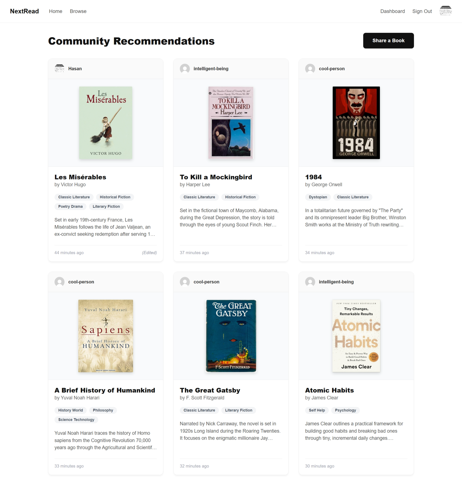
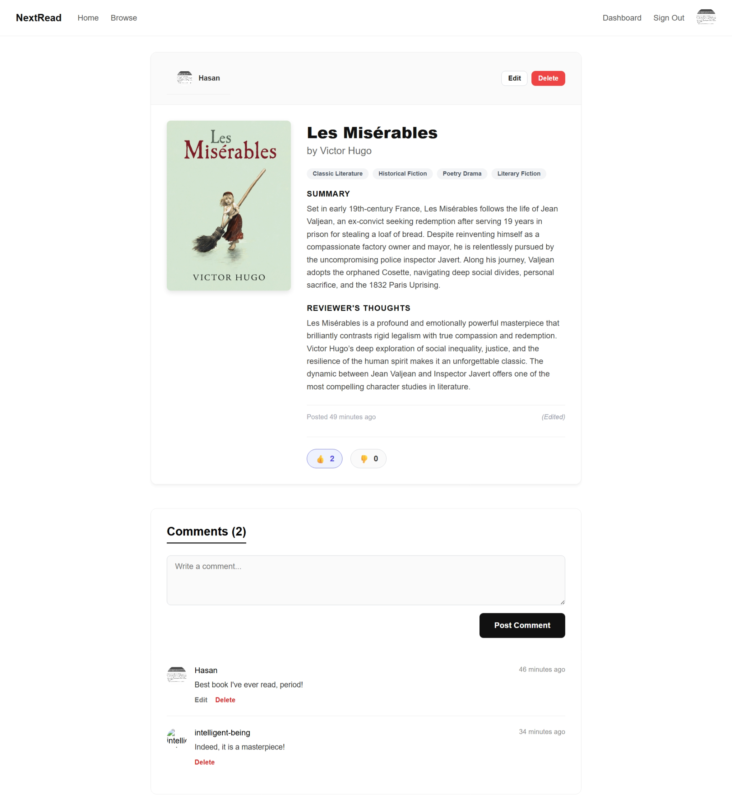
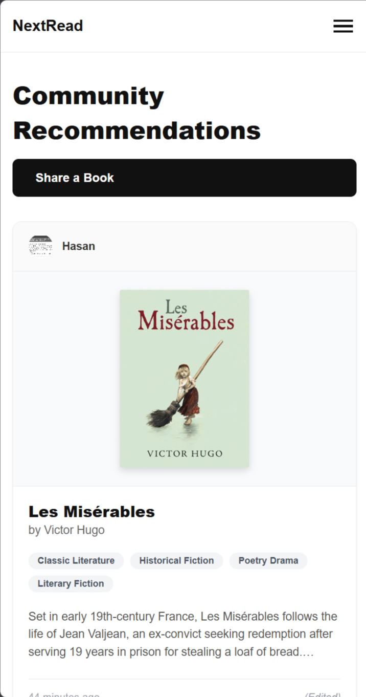

# NextRead - Book Recommendation Platform

A robust, full-stack Book Recommendation website built with Node.js, Express, and MongoDB. This platform features a clean, modern "GenUI" aesthetic, responsive card-based layouts, robust user authentication, and a dedicated admin dashboard for community management.





### Play The Game
[Deployed Website](https://nextread-6rfd.onrender.com)

[Planning Material](https://trello.com/b/s2yLImKF/nextread-planning-material-and-progress-indicator)


## Features

* **User Authentication & Authorization**: Secure sign-up and sign-in workflows with password hashing. Role-based access control separates standard users from administrators.
* **Profile Management**: Users can edit their account details, change passwords, and upload profile pictures hosted via Cloudinary.
* **Book Management**: Users can browse, add, and review books. Includes multi-select genre tagging (powered by Tom Select) and cover image uploads.
* **Social Interactions**: Users can like or dislike books, as well as leave and manage comments on book details pages. Includes relative timestamp formatting.
* **Admin Dashboard**: A centralized control panel providing high-level metrics (total users, books, and comments) and a data table for managing the community.
* **Modern UI/UX**: Built with a custom, semantic CSS system using CSS variables, unified form groups, and responsive authentication cards.

## Tech Stack

* **Backend**: Node.js, Express.js
* **Database**: MongoDB, Mongoose
* **View Engine**: EJS (Embedded JavaScript templates)
* **Image Hosting**: Cloudinary
* **UI/UX**: Custom CSS, Tom Select (for multi-select inputs)

## Prerequisites

Before running this project locally, ensure you have the following installed:
* Node.js (v14 or higher)
* MongoDB (running locally or a MongoDB Atlas URI)
* A Cloudinary account for handling image uploads

## Installation and Setup

**1. Clone the repository**
```bash
git clone https://github.com/HassanAlsurh/NextRead.git
cd NextRead
```

**2. Install dependencies**
```bash
npm install
```

**3. Set up environment variables**
Create a `.env` file in the root directory and add the following variables:
```env
PORT=3000
MONGODB_URI=your_mongodb_connection_string
SESSION_SECRET=your_secret_key_for_sessions
```
#### Cloudinary Configuration
```env
CLOUDINARY_CLOUD_NAME=your_cloud_name
CLOUDINARY_API_KEY=your_api_key
CLOUDINARY_API_SECRET=your_api_secret
```

**4. Start the application**
#### For development with auto-restarting:
```bash
nodemon server.js
```

**5. Access the app**
Open your browser and navigate to `http://localhost:3000`.

## Application Structure

* **`models/`**: Mongoose schemas for `User`, `Book`, and `Comment`.
* **`views/`**: EJS templates including authentication flows, book CRUD views, user profiles, and the admin dashboard.
* **`public/`**: Static assets, including the centralized `style.css`.
* **`controllers/`**: Route handlers and general logic for the application.

## Assets Used

* **Image Hosting & Media Management:**
  * **[Cloudinary](https://cloudinary.com/):** Used for cloud storage and optimization of all dynamic user-uploaded assets, including book cover images and user profile pictures.
  * **Default Assets:** Standardized default avatar fallbacks (`defualtPFP_z73q31.jpg`) hosted via Cloudinary CDN to maintain layout consistency for new user accounts.

* **UI/UX Components & Styling:**
  * **GenUI Design System:** Custom-built, responsive CSS architecture utilizing modern CSS Grid, Flexbox layouts, and CSS Variables for cohesive visual branding without relying on heavy external UI frameworks.
  * **[Tom Select](https://tom-select.js.org/):** A lightweight, zero-dependency dynamic select box control used to enhance native HTML `<select>` elements for multi-tagging book genres and clean, interactive form inputs.
  * **Native HTML5 Popover API:** Leveraged lightweight, browser-native dialog modals (`popover` attribute) with CSS `::backdrop` blurring for non-intrusive interactive controls (comment editing, custom deletion confirmations).
  * **Typography & Icons:** Native system font stack for clean readability, paired with Unicode emojis (`👍`, `👎`) for lightweight, zero-dependency interaction badges.

* **Formatting & Utilities:**
  * **Intl.RelativeTimeFormat:** Native JavaScript Internationalization API used to compute and render dynamic, user-friendly timestamps (e.g., "5 minutes ago") across community recommendations and discussion threads.

## Future Enhancements
  * Enable the ban button for the admin
  * Analytics in dashboard
  * Users dashboard
  * History page for users
  * Implement Wishlist 1: use API to show daily quotes

## Credits
This project would've not been possible without the help and support of my instructor in GA, Ms. **Nabila** and the Instructor Associates, Ms. **Zainab** and Ms. **Bidoor**.